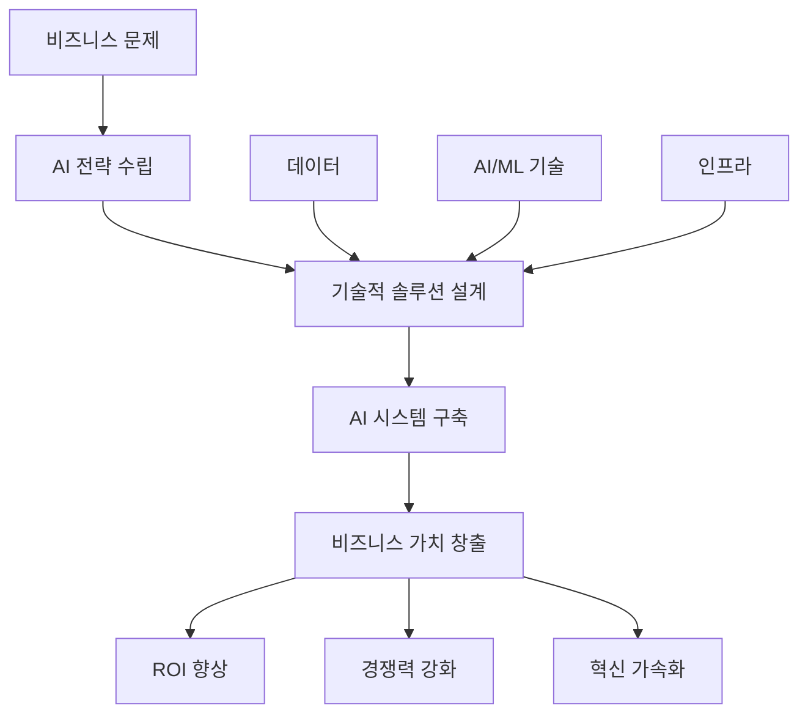

# AI 아키텍트: 인공지능 시대의 새로운 기술 리더십

인공지능이 비즈니스의 핵심 동력이 되면서, AI 시스템을 설계하고 구축하는 전문가에 대한 수요가 급증하고 있습니다. AI 아키텍트(AI Architect)는 이러한 시대적 요구에 부응하여 등장한 새로운 역할로, 전통적인 시스템 아키텍트의 역량에 AI/ML 전문성을 결합한 포지션입니다.

## AI 아키텍트의 정의와 핵심 가치

### 정의

AI 아키텍트는 조직의 AI 전략을 기술적으로 실현하기 위해 AI/ML 시스템의 전체적인 아키텍처를 설계하고, 데이터부터 모델 배포까지의 전체 AI 파이프라인을 책임지는 전문가입니다.

### 핵심 가치 제안



**전략적 가치**
- AI 기술을 비즈니스 목표와 정렬
- 조직의 AI 성숙도 향상 및 디지털 트랜스포메이션 가속화
- 데이터 자산을 활용한 새로운 비즈니스 기회 창출

## AI 아키텍트의 핵심 역할과 책임

### 1. AI 전략 및 로드맵 수립

AI 아키텍트는 조직의 비즈니스 목표를 분석하여 AI 도입 전략과 구현 로드맵을 수립합니다.

```python
# AI 전략 수립 프레임워크 예시
class AIStrategyFramework:
    def __init__(self):
        self.business_objectives = []
        self.use_cases = []
        self.technical_requirements = []
        self.implementation_roadmap = []
    
    def assess_ai_readiness(self, organization):
        """조직의 AI 준비도 평가"""
        return {
            'data_maturity': self.evaluate_data_infrastructure(organization),
            'talent_capability': self.assess_team_skills(organization),
            'technology_stack': self.analyze_current_tech(organization),
            'organizational_culture': self.evaluate_ai_culture(organization)
        }
    
    def prioritize_use_cases(self, use_cases):
        """AI 사용 사례 우선순위 결정"""
        scored_cases = []
        for case in use_cases:
            score = (
                case.business_impact * 0.4 +
                case.technical_feasibility * 0.3 +
                case.data_availability * 0.2 +
                case.resource_requirement * 0.1
            )
            scored_cases.append((case, score))
        
        return sorted(scored_cases, key=lambda x: x[1], reverse=True)
```

### 2. 데이터 아키텍처 설계

AI 시스템의 성공은 데이터의 품질과 접근성에 크게 좌우됩니다. AI 아키텍트는 AI/ML 워크로드에 최적화된 데이터 아키텍처를 설계합니다.

```yaml
# 현대적 AI 데이터 아키텍처 예시
data_architecture:
  ingestion:
    batch:
      - Apache Airflow for scheduled ETL
      - Apache Spark for large-scale processing
    streaming:
      - Apache Kafka for real-time data streams
      - Apache Flink for stream processing
  
  storage:
    data_lake:
      - AWS S3 / Azure Data Lake for raw data
      - Delta Lake for ACID transactions
    data_warehouse:
      - Snowflake / BigQuery for structured analytics
    feature_store:
      - Feast / Tecton for ML feature management
  
  processing:
    batch_ml:
      - Apache Spark MLlib
      - Dask for distributed computing
    real_time_inference:
      - Apache Kafka Streams
      - Redis for feature caching
  
  governance:
    catalog: "Apache Atlas for metadata management"
    lineage: "DataHub for data lineage tracking"
    quality: "Great Expectations for data validation"
    privacy: "Differential privacy for sensitive data"
```

### 3. ML 파이프라인 및 MLOps 구축

```python
# MLOps 파이프라인 아키텍처 예시
from dataclasses import dataclass
from typing import List, Dict, Any

@dataclass
class MLPipeline:
    """ML 파이프라인 정의"""
    
    def __init__(self):
        self.data_pipeline = DataPipeline()
        self.training_pipeline = TrainingPipeline()
        self.deployment_pipeline = DeploymentPipeline()
        self.monitoring_pipeline = MonitoringPipeline()
    
    def design_mlops_architecture(self):
        """MLOps 아키텍처 설계"""
        return {
            'experimentation': {
                'platform': 'MLflow / Weights & Biases',
                'notebooks': 'JupyterHub / SageMaker Studio',
                'compute': 'Kubernetes / SageMaker Training Jobs'
            },
            
            'training': {
                'orchestration': 'Kubeflow Pipelines / SageMaker Pipelines',
                'distributed_training': 'Horovod / Ray',
                'hyperparameter_tuning': 'Optuna / SageMaker HPO'
            },
            
            'deployment': {
                'model_registry': 'MLflow Model Registry',
                'serving': 'KServe / SageMaker Endpoints',
                'batch_inference': 'Apache Spark / EMR',
                'edge_deployment': 'TensorFlow Lite / ONNX Runtime'
            },
            
            'monitoring': {
                'data_drift': 'Evidently AI / Amazon SageMaker Model Monitor',
                'model_performance': 'Custom metrics + Prometheus',
                'explainability': 'LIME / SHAP integration',
                'a_b_testing': 'Custom experimentation framework'
            }
        }

class DataPipeline:
    """데이터 파이프라인 관리"""
    
    def validate_data_quality(self, data):
        """데이터 품질 검증"""
        checks = [
            self.check_completeness(data),
            self.check_consistency(data),
            self.check_validity(data),
            self.detect_anomalies(data)
        ]
        return all(checks)
    
    def feature_engineering(self, raw_data):
        """특성 엔지니어링"""
        return {
            'numerical_features': self.process_numerical(raw_data),
            'categorical_features': self.process_categorical(raw_data),
            'text_features': self.process_text(raw_data),
            'temporal_features': self.process_temporal(raw_data)
        }
```

### 4. AI 시스템 보안 및 거버넌스

AI 시스템의 보안과 윤리적 운영은 AI 아키텍트의 중요한 책임 영역입니다.

```python
# AI 거버넌스 프레임워크
class AIGovernanceFramework:
    
    def __init__(self):
        self.ethical_guidelines = self.setup_ethical_guidelines()
        self.security_controls = self.setup_security_controls()
        self.compliance_framework = self.setup_compliance()
    
    def setup_ethical_guidelines(self):
        """AI 윤리 가이드라인 설정"""
        return {
            'fairness': {
                'bias_detection': 'Automated bias testing in CI/CD',
                'fairness_metrics': 'Equalized odds, demographic parity',
                'mitigation_strategies': 'Data augmentation, algorithmic corrections'
            },
            
            'transparency': {
                'explainability': 'Model interpretability requirements',
                'documentation': 'Model cards and data sheets',
                'audit_trail': 'Complete decision tracking'
            },
            
            'privacy': {
                'data_minimization': 'Collect only necessary data',
                'anonymization': 'K-anonymity and differential privacy',
                'consent_management': 'Granular consent controls'
            },
            
            'accountability': {
                'human_oversight': 'Human-in-the-loop for critical decisions',
                'error_handling': 'Graceful degradation strategies',
                'responsibility_assignment': 'Clear ownership structure'
            }
        }
    
    def implement_model_monitoring(self):
        """모델 모니터링 구현"""
        monitoring_stack = {
            'performance_monitoring': {
                'accuracy_tracking': 'Real-time accuracy metrics',
                'latency_monitoring': 'Response time tracking',
                'throughput_analysis': 'Request volume analysis'
            },
            
            'data_monitoring': {
                'drift_detection': 'Statistical drift tests',
                'data_quality_checks': 'Automated data validation',
                'feature_importance_tracking': 'Feature contribution analysis'
            },
            
            'business_monitoring': {
                'kpi_tracking': 'Business metrics alignment',
                'roi_measurement': 'Return on AI investment',
                'user_satisfaction': 'Feedback loop integration'
            }
        }
        return monitoring_stack
```

## AI 아키텍트에게 필요한 핵심 역량

### 1. 기술적 역량 (Technical Competencies)

#### AI/ML 알고리즘 이해

```python
# 다양한 AI/ML 기법에 대한 이해 예시
class AIAlgorithmExpertise:
    
    def select_algorithm(self, problem_type, data_characteristics):
        """문제 유형과 데이터 특성에 따른 알고리즘 선택"""
        
        algorithm_matrix = {
            'supervised_learning': {
                'tabular_data': {
                    'small_dataset': ['Random Forest', 'SVM', 'XGBoost'],
                    'large_dataset': ['Neural Networks', 'LightGBM'],
                    'interpretable': ['Linear Regression', 'Decision Trees']
                },
                'image_data': {
                    'classification': ['CNN', 'Vision Transformers'],
                    'detection': ['YOLO', 'R-CNN variants'],
                    'segmentation': ['U-Net', 'Mask R-CNN']
                },
                'text_data': {
                    'classification': ['BERT', 'RoBERTa', 'DistilBERT'],
                    'generation': ['GPT variants', 'T5'],
                    'translation': ['mT5', 'MarianMT']
                }
            },
            
            'unsupervised_learning': {
                'clustering': ['K-Means', 'DBSCAN', 'Hierarchical'],
                'dimensionality_reduction': ['PCA', 't-SNE', 'UMAP'],
                'anomaly_detection': ['Isolation Forest', 'One-Class SVM']
            },
            
            'reinforcement_learning': {
                'discrete_actions': ['DQN', 'A3C', 'PPO'],
                'continuous_actions': ['DDPG', 'SAC', 'TD3'],
                'multi_agent': ['MADDPG', 'QMIX']
            }
        }
        
        return self.recommend_algorithms(problem_type, data_characteristics, algorithm_matrix)
```

#### 클라우드 및 분산 시스템

```yaml
# 클라우드 AI 서비스 활용 전략
cloud_ai_services:
  aws:
    compute:
      - "SageMaker for end-to-end ML lifecycle"
      - "EC2 P4d instances for large model training"
      - "Lambda for serverless inference"
    
    ai_services:
      - "Rekognition for computer vision"
      - "Comprehend for NLP"
      - "Bedrock for foundation models"
    
    data:
      - "S3 for data lake storage"
      - "Redshift for data warehousing"
      - "Kinesis for real-time streaming"
  
  azure:
    compute:
      - "Azure Machine Learning for MLOps"
      - "AKS for container orchestration"
      - "Functions for serverless computing"
    
    ai_services:
      - "Cognitive Services for pre-built AI"
      - "OpenAI Service for GPT models"
      - "Custom Vision for image classification"
  
  gcp:
    compute:
      - "Vertex AI for unified ML platform"
      - "GKE for Kubernetes workloads"
      - "Cloud Functions for event-driven processing"
    
    ai_services:
      - "Vision AI for image analysis"
      - "Natural Language AI for text processing"
      - "Vertex AI Model Garden for pre-trained models"
```

### 2. 비즈니스 역량 (Business Acumen)

#### ROI 측정 및 비즈니스 케이스 개발

```python
class AIBusinessCase:
    
    def calculate_ai_roi(self, project_metrics):
        """AI 프로젝트 ROI 계산"""
        
        benefits = {
            'cost_savings': {
                'automation': project_metrics.get('processes_automated', 0) * 50000,
                'efficiency_gains': project_metrics.get('efficiency_improvement', 0) * 100000,
                'error_reduction': project_metrics.get('error_rate_reduction', 0) * 25000
            },
            
            'revenue_generation': {
                'new_products': project_metrics.get('new_revenue_streams', 0),
                'customer_retention': project_metrics.get('churn_reduction', 0) * 150000,
                'conversion_improvement': project_metrics.get('conversion_lift', 0) * 200000
            }
        }
        
        costs = {
            'development': {
                'team_costs': project_metrics.get('team_size', 5) * 150000,
                'infrastructure': project_metrics.get('cloud_costs', 50000),
                'tools_licenses': project_metrics.get('tool_costs', 25000)
            },
            
            'operational': {
                'maintenance': project_metrics.get('maintenance_costs', 30000),
                'monitoring': project_metrics.get('monitoring_costs', 15000),
                'governance': project_metrics.get('governance_costs', 20000)
            }
        }
        
        total_benefits = sum([sum(category.values()) for category in benefits.values()])
        total_costs = sum([sum(category.values()) for category in costs.values()])
        
        roi = (total_benefits - total_costs) / total_costs * 100
        payback_period = total_costs / (total_benefits / 12)  # months
        
        return {
            'roi_percentage': roi,
            'payback_period_months': payback_period,
            'net_present_value': self.calculate_npv(total_benefits, total_costs),
            'total_benefits': total_benefits,
            'total_costs': total_costs
        }
```

### 3. 리더십 및 소프트 스킬

#### 크로스 펑셔널 팀 리더십

```markdown
## AI 프로젝트 팀 구성 및 관리

### 🎯 다학제적 팀 구성
- **데이터 사이언티스트**: 모델 개발 및 실험
- **ML 엔지니어**: 모델 운영화 및 배포
- **데이터 엔지니어**: 데이터 파이프라인 구축
- **소프트웨어 엔지니어**: 애플리케이션 통합
- **도메인 전문가**: 비즈니스 로직 및 검증
- **UX/UI 디자이너**: 사용자 경험 설계

### 🤝 효과적인 협업 방법론
1. **애자일 + MLOps**: 반복적 개발과 지속적 배포
2. **Design Thinking**: 사용자 중심의 AI 솔루션 설계
3. **데이터 중심 의사결정**: 실험과 검증을 통한 진행

### 📊 성과 관리 및 평가
- **기술적 메트릭**: 모델 성능, 시스템 안정성
- **비즈니스 메트릭**: ROI, 사용자 만족도
- **프로세스 메트릭**: 개발 속도, 배포 빈도
```

## AI 아키텍처 설계 원칙

### 1. 확장성과 유연성

```python
# 확장 가능한 AI 아키텍처 설계 원칙
class ScalableAIArchitecture:
    
    def design_microservices_ai(self):
        """마이크로서비스 기반 AI 아키텍처"""
        return {
            'model_serving': {
                'pattern': 'Model-as-a-Service',
                'scaling': 'Horizontal auto-scaling',
                'load_balancing': 'Intelligent routing based on model capacity',
                'versioning': 'Blue-green deployment for models'
            },
            
            'data_processing': {
                'pattern': 'Event-driven architecture',
                'streaming': 'Apache Kafka for real-time processing',
                'batch': 'Apache Spark for large-scale processing',
                'orchestration': 'Apache Airflow for workflow management'
            },
            
            'feature_management': {
                'feature_store': 'Centralized feature repository',
                'real_time_features': 'Redis for low-latency serving',
                'batch_features': 'Data warehouse for historical features',
                'feature_versioning': 'Git-like versioning for features'
            }
        }
    
    def implement_edge_ai(self):
        """엣지 AI 아키텍처 구현"""
        return {
            'model_optimization': {
                'quantization': 'INT8/FP16 precision reduction',
                'pruning': 'Remove redundant model parameters',
                'distillation': 'Compress large models to smaller ones',
                'compilation': 'TensorRT/CoreML optimization'
            },
            
            'deployment_strategy': {
                'containerization': 'Docker for consistent deployment',
                'orchestration': 'K3s for lightweight Kubernetes',
                'updates': 'Over-the-air model updates',
                'fallback': 'Graceful degradation to cloud'
            }
        }
```

### 2. 관측가능성과 모니터링

```yaml
# AI 시스템 관측가능성 구현
observability_stack:
  metrics:
    model_performance:
      - accuracy, precision, recall, F1-score
      - inference_latency, throughput
      - resource_utilization (CPU, GPU, memory)
    
    business_metrics:
      - conversion_rate, revenue_impact
      - user_engagement, satisfaction_scores
      - cost_per_prediction, ROI
  
  logging:
    structured_logging:
      - JSON format for machine readability
      - Correlation IDs for request tracing
      - Feature values and predictions
    
    log_aggregation:
      - ELK Stack (Elasticsearch, Logstash, Kibana)
      - Centralized logging with retention policies
  
  tracing:
    distributed_tracing:
      - Jaeger for request flow tracking
      - OpenTelemetry for standardized instrumentation
      - Performance bottleneck identification
  
  alerting:
    smart_alerts:
      - Anomaly detection for metrics
      - Threshold-based alerts for SLA violations
      - Predictive alerts for capacity planning
```

### 3. 보안과 프라이버시

```python
class AISecurityFramework:
    
    def implement_secure_ai(self):
        """보안이 강화된 AI 시스템 구현"""
        return {
            'data_security': {
                'encryption': {
                    'at_rest': 'AES-256 encryption for stored data',
                    'in_transit': 'TLS 1.3 for data transmission',
                    'in_use': 'Homomorphic encryption for computation'
                },
                
                'access_control': {
                    'authentication': 'Multi-factor authentication',
                    'authorization': 'Role-based access control (RBAC)',
                    'audit': 'Comprehensive access logging'
                }
            },
            
            'model_security': {
                'adversarial_defense': {
                    'input_validation': 'Robust input sanitization',
                    'adversarial_training': 'Train against adversarial examples',
                    'detection_systems': 'Real-time attack detection'
                },
                
                'model_protection': {
                    'intellectual_property': 'Model watermarking',
                    'inference_privacy': 'Differential privacy techniques',
                    'secure_computation': 'Federated learning approaches'
                }
            },
            
            'privacy_compliance': {
                'data_governance': {
                    'gdpr_compliance': 'Right to be forgotten implementation',
                    'data_lineage': 'Complete data provenance tracking',
                    'consent_management': 'Granular consent controls'
                },
                
                'privacy_technologies': {
                    'anonymization': 'K-anonymity and L-diversity',
                    'synthetic_data': 'Generative models for privacy',
                    'federated_learning': 'Decentralized model training'
                }
            }
        }
```

## AI 아키텍트의 미래와 발전 방향

### 1. 생성형 AI와 대규모 언어 모델 (LLM)

```python
# 생성형 AI 아키텍처 설계
class GenerativeAIArchitecture:
    
    def design_llm_infrastructure(self):
        """LLM 인프라 설계"""
        return {
            'model_serving': {
                'inference_optimization': {
                    'techniques': ['Model sharding', 'Tensor parallelism', 'Pipeline parallelism'],
                    'hardware': 'Multi-GPU clusters with high-bandwidth interconnects',
                    'caching': 'KV-cache optimization for transformer models'
                },
                
                'cost_optimization': {
                    'dynamic_batching': 'Continuous batching for varying request sizes',
                    'model_quantization': 'INT8/FP16 precision for reduced memory',
                    'auto_scaling': 'Demand-based scaling with cold start optimization'
                }
            },
            
            'prompt_engineering': {
                'prompt_management': {
                    'versioning': 'Git-based prompt version control',
                    'testing': 'A/B testing for prompt variations',
                    'optimization': 'Automated prompt tuning'
                },
                
                'safety_measures': {
                    'content_filtering': 'Multi-layer content moderation',
                    'bias_detection': 'Real-time bias monitoring',
                    'hallucination_detection': 'Factual accuracy verification'
                }
            }
        }
    
    def implement_rag_architecture(self):
        """RAG (Retrieval-Augmented Generation) 아키텍처"""
        return {
            'knowledge_base': {
                'vector_database': 'Pinecone/Weaviate for semantic search',
                'indexing_strategy': 'Hierarchical indexing for multi-scale retrieval',
                'update_mechanism': 'Real-time knowledge base updates'
            },
            
            'retrieval_system': {
                'embedding_models': 'Domain-specific embedding fine-tuning',
                'ranking_algorithm': 'Learning-to-rank for relevance scoring',
                'context_selection': 'Dynamic context window optimization'
            },
            
            'generation_pipeline': {
                'context_integration': 'Seamless context and query fusion',
                'response_validation': 'Consistency and factuality checks',
                'feedback_loop': 'User feedback for continuous improvement'
            }
        }
```

### 2. 자동화된 ML (AutoML)과 AI Democratization

```yaml
# AutoML 플랫폼 아키텍처
automl_platform:
  user_interface:
    no_code: "Drag-and-drop interface for business users"
    low_code: "Configuration-based ML for technical users"
    pro_code: "Full programmatic control for experts"
  
  automated_pipeline:
    data_preparation:
      - "Automated data quality assessment"
      - "Smart feature engineering"
      - "Intelligent data preprocessing"
    
    model_selection:
      - "Multi-algorithm experimentation"
      - "Neural architecture search (NAS)"
      - "Automated hyperparameter optimization"
    
    model_evaluation:
      - "Cross-validation strategies"
      - "Fairness and bias assessment"
      - "Interpretability analysis"
  
  governance:
    explainability: "Automated model interpretation"
    compliance: "Built-in regulatory compliance checks"
    monitoring: "Automated model performance tracking"
```

### 3. 지속가능한 AI (Sustainable AI)

```python
class SustainableAIFramework:
    
    def optimize_energy_efficiency(self):
        """에너지 효율적인 AI 시스템 설계"""
        return {
            'model_efficiency': {
                'architecture_optimization': {
                    'efficient_models': 'MobileNet, EfficientNet variants',
                    'pruning_strategies': 'Structured and unstructured pruning',
                    'knowledge_distillation': 'Teacher-student model compression'
                },
                
                'training_optimization': {
                    'early_stopping': 'Intelligent training termination',
                    'mixed_precision': 'FP16/BF16 for reduced computation',
                    'gradient_checkpointing': 'Memory-efficient training'
                }
            },
            
            'infrastructure_optimization': {
                'green_computing': {
                    'renewable_energy': 'Carbon-neutral data centers',
                    'efficient_hardware': 'Specialized AI chips (TPUs, FPGAs)',
                    'workload_scheduling': 'Time-shifting for renewable energy'
                },
                
                'resource_management': {
                    'dynamic_scaling': 'Demand-based resource allocation',
                    'multi_tenancy': 'Shared infrastructure utilization',
                    'edge_computing': 'Reduced data transmission requirements'
                }
            }
        }
    
    def measure_carbon_footprint(self, model_metrics):
        """AI 모델의 탄소 발자국 측정"""
        # 간소화된 계산 예시
        energy_consumption = (
            model_metrics['training_hours'] * model_metrics['gpu_count'] * 
            model_metrics['power_per_gpu'] / 1000  # kWh
        )
        
        carbon_emission = energy_consumption * model_metrics['grid_carbon_intensity']
        
        return {
            'energy_consumption_kwh': energy_consumption,
            'carbon_emission_kg': carbon_emission,
            'efficiency_score': model_metrics['model_performance'] / carbon_emission
        }
```

## AI 아키텍트로서의 커리어 개발

### 1. 학습 경로와 역량 개발

```markdown
## AI 아키텍트 커리어 로드맵

### 📚 기초 역량 구축 (6-12개월)
- **수학/통계**: 선형대수, 확률론, 통계학
- **프로그래밍**: Python, R, SQL 마스터리
- **ML 기초**: Scikit-learn, TensorFlow/PyTorch
- **데이터 처리**: Pandas, NumPy, Apache Spark

### 🔬 중급 역량 개발 (1-2년)
- **딥러닝**: CNN, RNN, Transformer 아키텍처
- **MLOps**: MLflow, Kubeflow, CI/CD for ML
- **클라우드**: AWS/Azure/GCP AI 서비스
- **분산 시스템**: Kubernetes, Docker, Apache Kafka

### 🏗️ 고급 아키텍처 역량 (2-3년)
- **시스템 설계**: 대규모 AI 시스템 아키텍처
- **리더십**: 팀 관리, 프로젝트 리더십
- **비즈니스**: 전략 수립, ROI 분석
- **신기술**: 최신 AI 트렌드, 연구 동향
```

### 2. 실무 경험과 프로젝트

```python
# AI 아키텍트 포트폴리오 프로젝트 예시
class AIArchitectPortfolio:
    
    def design_recommendation_system(self):
        """추천 시스템 아키텍처 설계"""
        return {
            'business_case': 'E-commerce 개인화 추천',
            'technical_solution': {
                'data_pipeline': 'Real-time user behavior tracking',
                'algorithms': 'Collaborative filtering + Deep learning',
                'infrastructure': 'Microservices on Kubernetes',
                'performance': '100ms p99 latency, 15% conversion lift'
            },
            'lessons_learned': [
                'Cold start problem mitigation strategies',
                'A/B testing for recommendation algorithms',
                'Scalability challenges and solutions'
            ]
        }
    
    def implement_computer_vision_platform(self):
        """컴퓨터 비전 플랫폼 구축"""
        return {
            'business_case': 'Manufacturing quality control automation',
            'technical_solution': {
                'model_architecture': 'Custom CNN with attention mechanisms',
                'edge_deployment': 'TensorRT optimization for real-time inference',
                'data_strategy': 'Synthetic data generation for rare defects',
                'monitoring': 'Drift detection and model retraining'
            },
            'impact': {
                'accuracy_improvement': '95% to 99.2% defect detection',
                'cost_savings': '$2M annually in quality control costs',
                'processing_speed': '10x faster than manual inspection'
            }
        }
```

### 3. 커뮤니티 참여와 지속적 학습

```markdown
## 전문성 개발을 위한 활동

### 🌐 커뮤니티 참여
- **오픈소스 기여**: TensorFlow, PyTorch 생태계 참여
- **기술 블로그**: 아키텍처 설계 경험 공유
- **컨퍼런스 발표**: NeurIPS, ICML, 산업 컨퍼런스
- **멘토링**: 주니어 개발자/데이터 사이언티스트 지도

### 📖 지속적 학습
- **논문 리뷰**: 최신 AI 연구 동향 파악
- **온라인 코스**: Coursera, edX, Udacity 전문 과정
- **실험 프로젝트**: 새로운 기술과 프레임워크 탐색
- **산업 네트워킹**: AI 커뮤니티 및 전문가 그룹 참여

### 🏆 인증 및 자격
- **클라우드 인증**: AWS ML Specialty, Google Cloud ML Engineer
- **전문 인증**: Certified Analytics Professional (CAP)
- **학위**: AI/ML 관련 석사/박사 (선택적)
```

## 마무리: AI 아키텍트의 미래 비전

AI 아키텍트는 단순히 기술적 전문가를 넘어서 조직의 AI 트랜스포메이션을 이끄는 전략적 리더입니다. 빠르게 진화하는 AI 기술 환경에서 성공하기 위해서는 기술적 깊이와 비즈니스 통찰력, 그리고 지속적인 학습 능력이 필수적입니다.

미래의 AI 아키텍트는 다음과 같은 도전과 기회에 직면하게 될 것입니다:

**새로운 도전과제**
- **AGI와 초지능**: 일반 인공지능 시대를 대비한 아키텍처 설계
- **양자 컴퓨팅**: 양자-고전 하이브리드 AI 시스템 구축
- **뉴로모픽 컴퓨팅**: 뇌 구조를 모방한 새로운 컴퓨팅 패러다임
- **AI 윤리와 규제**: 점점 강화되는 AI 거버넌스 요구사항

**새로운 기회**
- **산업별 특화**: 의료, 금융, 제조업 등 도메인 전문 AI 아키텍트
- **지속가능성**: 그린 AI와 탄소 중립 기술 리더십
- **민주화**: AI의 대중화를 위한 플랫폼과 도구 개발
- **혁신 가속**: AI 네이티브 조직 구축과 디지털 혁신

AI 아키텍트로서 성공하기 위해서는 기술적 전문성을 바탕으로 하되, 인간 중심의 AI 설계 철학과 지속가능한 발전에 대한 비전을 갖추는 것이 중요합니다. 이를 통해 기술이 인류의 번영에 기여할 수 있는 방향으로 AI 시스템을 설계하고 구축해 나가야 할 것입니다.
