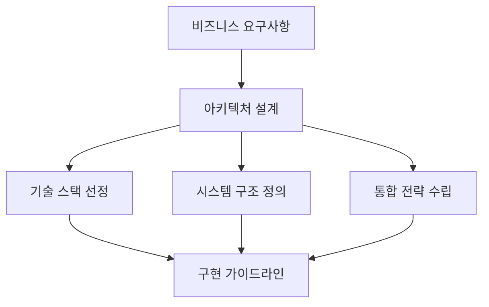
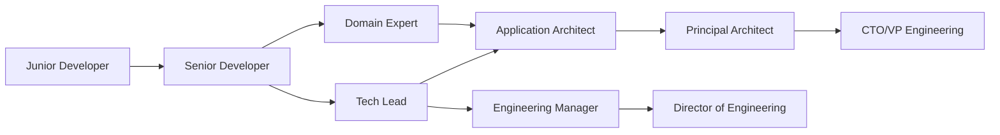

# 애플리케이션 아키텍트란 무엇인가: 역할, 책임, 그리고 필요한 역량

현대 소프트웨어 개발에서 애플리케이션 아키텍트(Application Architect)는 기술과 비즈니스 사이의 가교 역할을 하는 핵심적인 포지션입니다. 단순히 코드를 작성하는 것을 넘어서 전체 시스템의 설계와 방향성을 결정하는 중요한 역할을 담당합니다.

## 애플리케이션 아키텍트의 정의

애플리케이션 아키텍트는 소프트웨어 애플리케이션의 전체적인 구조와 설계를 책임지는 기술 전문가입니다. 비즈니스 요구사항을 기술적 솔루션으로 변환하고, 개발팀이 일관된 방향으로 나아갈 수 있도록 가이드라인을 제시합니다.

### 핵심 정의 요소

**전략적 사고자**: 장기적인 관점에서 시스템을 설계하고 발전 방향을 제시  
**기술적 리더**: 복잡한 기술적 결정을 내리고 팀을 이끌어가는 역할  
**비즈니스 이해자**: 기술적 전문성과 비즈니스 도메인 지식을 모두 보유  
**커뮤니케이터**: 다양한 이해관계자들과 효과적으로 소통하는 능력

## 주요 역할과 책임

### 1. 시스템 아키텍처 설계



애플리케이션 아키텍트는 비즈니스 요구사항을 분석하여 최적의 시스템 구조를 설계합니다. 이는 단순히 기술적인 측면만을 고려하는 것이 아니라, 성능, 확장성, 보안, 유지보수성 등 다양한 품질 속성을 균형있게 고려하는 작업입니다.

**주요 활동:**
- 시스템의 전체적인 구조 및 컴포넌트 정의
- 데이터 흐름과 통신 패턴 설계
- 기술 스택 및 프레임워크 선정
- 아키텍처 원칙과 가이드라인 수립

### 2. 기술적 의사결정 및 표준화

```javascript
// 예시: 마이크로서비스 아키텍처 표준 정의
const architectureStandards = {
  communication: {
    synchronous: 'REST API with OpenAPI specification',
    asynchronous: 'Apache Kafka for event-driven architecture',
    authentication: 'JWT tokens with OAuth 2.0'
  },
  
  dataManagement: {
    database: 'PostgreSQL for transactional data',
    cache: 'Redis for session and application cache',
    search: 'Elasticsearch for full-text search'
  },
  
  monitoring: {
    logging: 'Structured logging with ELK stack',
    metrics: 'Prometheus + Grafana',
    tracing: 'Jaeger for distributed tracing'
  }
}
```

### 3. 개발팀 지원 및 멘토링

애플리케이션 아키텍트는 개발팀이 아키텍처 원칙에 따라 효과적으로 개발할 수 있도록 지원합니다.

**지원 활동:**
- 코드 리뷰 및 아키텍처 컴플라이언스 체크
- 기술적 문제 해결 지원
- 베스트 프랙티스 공유 및 교육
- 개발자 역량 강화를 위한 멘토링

### 4. 이해관계자와의 커뮤니케이션

```markdown
## 이해관계자별 커뮤니케이션 전략

### 🏢 경영진 (C-Level)
- **언어**: 비즈니스 가치, ROI, 리스크
- **포커스**: 전략적 목표 달성, 비용 효율성
- **산출물**: Executive Summary, ROI 분석

### 👥 제품 관리자 (Product Manager)
- **언어**: 기능 구현 가능성, 일정, 우선순위
- **포커스**: 요구사항 실현 방안, 기술적 제약사항
- **산출물**: 기술적 실현 가능성 분석, 아키텍처 로드맵

### 💻 개발팀 (Development Team)
- **언어**: 기술적 세부사항, 구현 가이드
- **포커스**: 실제 구현 방법, 베스트 프랙티스
- **산출물**: 아키텍처 문서, 코딩 가이드라인
```

## 필요한 핵심 역량

### 1. 기술적 역량 (Technical Skills)

#### 소프트웨어 아키텍처 패턴
```python
# 예시: 헥사고날 아키텍처 구현
class UserService:
    def __init__(self, user_repository: UserRepository):
        self.user_repository = user_repository
    
    def create_user(self, user_data: dict) -> User:
        # 비즈니스 로직 (도메인 계층)
        user = User.from_dict(user_data)
        user.validate()
        
        # 외부 의존성 (포트를 통한 접근)
        return self.user_repository.save(user)

# 포트 (인터페이스)
class UserRepository(ABC):
    @abstractmethod
    def save(self, user: User) -> User:
        pass

# 어댑터 (구현체)
class PostgreSQLUserRepository(UserRepository):
    def save(self, user: User) -> User:
        # 실제 데이터베이스 저장 로직
        pass
```

#### 클라우드 및 인프라 이해
- **컨테이너화**: Docker, Kubernetes
- **클라우드 서비스**: AWS, Azure, GCP
- **인프라 as 코드**: Terraform, CloudFormation
- **CI/CD**: Jenkins, GitLab CI, GitHub Actions

### 2. 비즈니스 역량 (Business Skills)

#### 도메인 지식
업계와 비즈니스 도메인에 대한 깊은 이해가 필요합니다. 이는 기술적 솔루션이 실제 비즈니스 문제를 해결할 수 있도록 보장합니다.

#### 비용 최적화
```yaml
# 예시: 클라우드 비용 최적화 전략
cost_optimization:
  compute:
    - "Right-sizing instances based on actual usage"
    - "Use spot instances for non-critical workloads"
    - "Implement auto-scaling policies"
  
  storage:
    - "Lifecycle policies for data archiving"
    - "Use appropriate storage classes"
    - "Regular cleanup of unused resources"
  
  monitoring:
    - "Set up cost alerts and budgets"
    - "Regular cost reviews with stakeholders"
    - "Track cost per feature/service"
```

### 3. 소프트 스킬 (Soft Skills)

#### 리더십과 영향력
- **비전 제시**: 기술적 비전을 명확히 전달
- **합의 도출**: 이해관계자 간의 의견 조율
- **변화 관리**: 조직의 기술적 변화를 이끌어나가는 능력

#### 커뮤니케이션
```markdown
## 효과적인 아키텍처 커뮤니케이션 방법

### 📊 시각적 표현
- 아키텍처 다이어그램 (C4 모델 활용)
- 시퀀스 다이어그램으로 상호작용 표현
- 마인드맵으로 복잡한 개념 정리

### 📝 문서화
- ADR (Architecture Decision Records) 작성
- 실용적이고 유지보수 가능한 문서
- 코드와 문서의 동기화 유지

### 🎯 맞춤형 메시지
- 청중에 따른 메시지 조정
- 기술적 세부사항과 비즈니스 가치의 균형
- 스토리텔링을 통한 설득력 있는 전달
```

## 애플리케이션 아키텍트의 커리어 패스

### 시니어 개발자 → 테크리드 → 아키텍트



### 각 단계별 핵심 역량 발전

**시니어 개발자 단계**
- 깊은 기술적 전문성 확보
- 멘토링 경험 쌓기
- 시스템 설계 경험 확대

**테크리드 단계**
- 팀 리더십 경험
- 아키텍처 의사결정 참여
- 이해관계자와의 커뮤니케이션 경험

**아키텍트 단계**
- 전체 시스템 관점에서의 사고
- 비즈니스와 기술의 연결
- 조직 차원의 영향력 발휘

## 현대적 도전과제와 대응 방안

### 1. 디지털 트랜스포메이션

```yaml
digital_transformation_challenges:
  legacy_systems:
    challenge: "기존 시스템과의 통합"
    solution: "점진적 마이그레이션 전략 수립"
    
  cloud_adoption:
    challenge: "클라우드 네이티브 아키텍처로의 전환"
    solution: "컨테이너화 및 마이크로서비스 도입"
    
  data_strategy:
    challenge: "데이터 중심 의사결정 체계 구축"
    solution: "데이터 레이크 및 분석 플랫폼 구축"
```

### 2. 마이크로서비스와 분산 시스템

현대의 애플리케이션 아키텍트는 분산 시스템의 복잡성을 다루는 능력이 필수적입니다.

**주요 고려사항:**
- **서비스 경계 설정**: Domain-Driven Design 원칙 적용
- **데이터 일관성**: Saga 패턴, Event Sourcing
- **장애 복구**: Circuit Breaker, Bulkhead 패턴
- **관측 가능성**: 분산 추적, 메트릭, 로그 통합

### 3. 보안과 컴플라이언스

```python
# 예시: 보안 아키텍처 고려사항
security_architecture = {
    'authentication': {
        'method': 'Multi-factor Authentication',
        'protocol': 'OAuth 2.0 + OpenID Connect',
        'token_management': 'JWT with short expiration'
    },
    
    'authorization': {
        'model': 'Role-Based Access Control (RBAC)',
        'principle': 'Least Privilege',
        'implementation': 'Policy-based authorization'
    },
    
    'data_protection': {
        'encryption_at_rest': 'AES-256',
        'encryption_in_transit': 'TLS 1.3',
        'data_classification': 'Public, Internal, Confidential, Restricted'
    },
    
    'compliance': {
        'frameworks': ['GDPR', 'SOC 2', 'ISO 27001'],
        'audit_trail': 'Comprehensive logging and monitoring',
        'data_retention': 'Policy-based lifecycle management'
    }
}
```

## 성공적인 애플리케이션 아키텍트가 되기 위한 조언

### 1. 지속적인 학습과 발전

**기술 트렌드 파악**
- 새로운 아키텍처 패턴과 기술 스택 연구
- 오픈소스 프로젝트 참여
- 컨퍼런스 및 기술 커뮤니티 활동

**도메인 지식 확장**
- 비즈니스 도메인에 대한 깊은 이해
- 산업 트렌드와 규제 환경 파악
- 고객과 사용자 관점에서의 사고

### 2. 실용적 접근법

```markdown
## 아키텍처 의사결정 프레임워크

### 🎯 목표 설정
1. 비즈니스 목표와 기술 목표의 정렬
2. 측정 가능한 성공 지표 정의
3. 제약사항과 전제조건 명확화

### ⚖️ 트레이드오프 분석
1. 각 옵션의 장단점 분석
2. 비용 대비 효과 평가
3. 리스크 평가 및 완화 방안

### 📊 의사결정 기록
1. ADR (Architecture Decision Records) 작성
2. 의사결정 배경과 근거 문서화
3. 정기적인 리뷰 및 업데이트
```

### 3. 팀과 조직에 미치는 영향

성공적인 애플리케이션 아키텍트는 기술적 우수성뿐만 아니라 팀과 조직 전체에 긍정적인 영향을 미칩니다.

**개발 생산성 향상**
- 명확한 가이드라인과 표준 제공
- 재사용 가능한 컴포넌트와 패턴 구축
- 효율적인 개발 프로세스 설계

**기술 부채 관리**
- 적절한 리팩토링 전략 수립
- 코드 품질 향상을 위한 체계 구축
- 장기적 관점에서의 기술적 투자 결정

## 마무리

애플리케이션 아키텍트는 단순히 기술적 전문가를 넘어서 비즈니스와 기술을 연결하는 핵심적인 역할을 담당합니다. 빠르게 변화하는 기술 환경 속에서 성공적인 아키텍트가 되기 위해서는 지속적인 학습, 실용적 사고, 그리고 효과적인 커뮤니케이션 능력이 필수적입니다.

미래의 애플리케이션 아키텍트는 AI, 클라우드, 그리고 새로운 컴퓨팅 패러다임에 대한 이해를 바탕으로 더욱 복잡하고 동적인 시스템을 설계하고 관리해야 할 것입니다. 이러한 도전을 준비하기 위해서는 기술적 깊이와 비즈니스 통찰력, 그리고 리더십을 균형있게 발전시켜 나가는 것이 중요합니다.
